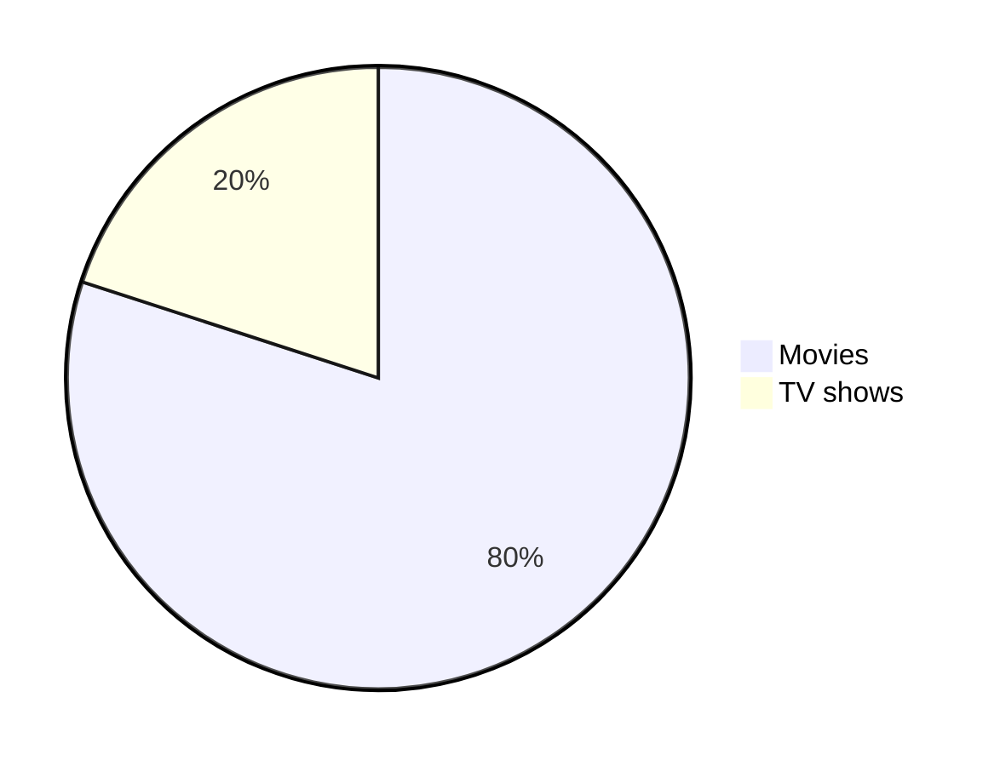

<a name="top"></a>

<h1 align="center">
:black_circle: The Ultimate Markdown Cheat Sheet :black_circle:
</h1>

<br/>

> [!IMPORTANT]
> Check out the official documentation on [GitHub](https://docs.github.com/en/get-started/writing-on-github/getting-started-with-writing-and-formatting-on-github/basic-writing-and-formatting-syntax) to learn more about writing and formatting syntax.

Markdown is a method for writing formatted text using a simple plain text format. This guide will provide you with a comprehensive understanding of the key commands in Markdown, aimed at enhancing your GitHub README.

You can read the full article on [Medium](https://towardsdatascience.com/the-ultimate-markdown-cheat-sheet-3d3976b31a0), but here's a brief overview of the most popular commands.

- [Headings](#headings)
- [Text styles](#text-styles)
- [Syntax Highlighting](#syntax-highlighting)
	* [Inline code](#inline-code)
	* [Code block](#code-block)
	* [Diff Code block](#diff-code-block)
- [Alignments](#alignments)
- [Tables](#tables)
- [Links](#links)
	* [Inline](#inline)
	* [Reference](#reference)
	* [Footnote](#footnote)
	* [Relative](#relative)
	* [Auto](#auto)
	* [Section](#section)
- [Images](#images)
- [Badges](#badges)
- [Lists](#lists)
	* [Ordered](#ordered)
	* [Unordered](#unordered)
	* [Task](#task)
- [Buttons](#buttons)
- [Collapsible items (28 July 2023)](#collapsible-items-28-july-2023)
- [Horizontal Rule](#horizontal-rule)
- [Diagrams (19 July 2022)](#diagrams-19-july-2022)
- [Mathematical expressions (19 July 2022)](#mathematical-expressions-19-july-2022)
- [Alerts (8 January 2024)](#alerts-8-january-2024)
- [Mention people and teams](#mention-people-and-teams)
- [Reference issues and pull requests](#reference-issues-and-pull-requests)
- [Color models](#color-models)
- [Miscellaneous](#miscellaneous)
	* [Comments](#comments)
	* [Escaping Markdown Characters](#escaping-markdown-characters)
- [Hash symbol](#hash-symbol)
	* [Emojis](#emojis)
	* [Line break](#line-break)
	* [Back to top](#back-to-top)
- [Bitbucket](#bitbucket)
- [Azure DevOps Project wiki](#azure-devops-project-wiki)
- [Tools](#tools)

# Headings

```markdown
# Heading 1
## Heading 2
### Heading 3
#### Heading 4
##### Heading 5
```
<!-- omit in toc -->
# Heading 1
<!-- omit in toc -->
## Heading 2
<!-- omit in toc -->
### Heading 3
<!-- omit in toc -->
#### Heading 4
<!-- omit in toc -->
##### Heading 5

```markdown
<h1>Heading 1</h1>
<h2>Heading 2</h2>
<h3>Heading 3</h3>
<h4>Heading 4</h4>
<h5>Heading 5</h5>
```

<!-- omit in toc -->
<h1>Heading 1</h1>
<!-- omit in toc -->
<h2>Heading 2</h2>
<!-- omit in toc -->
<h3>Heading 3</h3>
<!-- omit in toc -->
<h4>Heading 4</h4>
<!-- omit in toc -->
<h5>Heading 5</h5>

<!-- omit in toc -->
Heading 1
=
<!-- omit in toc -->
Heading 2
-

# Text styles

```markdown
Bold
**The quick brown fox jumps over the lazy dog.**
__The quick brown fox jumps over the lazy dog.__
<strong>The quick brown fox jumps over the lazy dog.</strong>
Italic
*The quick brown fox jumps over the lazy dog.*
_The quick brown fox jumps over the lazy dog._
<em>The quick brown fox jumps over the lazy dog.</em>
Bold and Italic
**_The quick brown fox jumps over the lazy dog._**
<strong><em>The quick brown fox jumps over the lazy dog.</em></strong>
```

The quick brown fox jumps over the lazy dog.

Bold

**The quick brown fox jumps over the lazy dog.**

__The quick brown fox jumps over the lazy dog.__

<strong>The quick brown fox jumps over the lazy dog.</strong>


Italic

*The quick brown fox jumps over the lazy dog.*

_The quick brown fox jumps over the lazy dog._

<em>The quick brown fox jumps over the lazy dog.</em>

Bold and Italic

**_The quick brown fox jumps over the lazy dog._**

<strong><em>The quick brown fox jumps over the lazy dog.</em></strong>

Blockquotes

```markdown
> The quick brown fox jumps over the lazy dog.
> The quick brown fox jumps over the lazy dog.
>
> The quick brown fox jumps over the lazy dog.
>
> The quick brown fox jumps over the lazy dog.
> The quick brown fox jumps over the lazy dog.
>> The quick brown fox jumps over the lazy dog.
>>> The quick brown fox jumps over the lazy dog.
> **The quick brown fox** *jumps over the lazy dog.*
```

> The quick brown fox jumps over the lazy dog.

> The quick brown fox jumps over the lazy dog.
>
> The quick brown fox jumps over the lazy dog.
>
> The quick brown fox jumps over the lazy dog.

> The quick brown fox jumps over the lazy dog.
>> The quick brown fox jumps over the lazy dog.
>>> The quick brown fox jumps over the lazy dog.

> **The quick brown fox** *jumps over the lazy dog.*

```markdown
Monospaced
<samp>The quick brown fox jumps over the lazy dog.</samp>

Underlined
<ins>The quick brown fox jumps over the lazy dog.</ins>

Strike-through
~~The quick brown fox jumps over the lazy dog.~~
```

Monospaced

<samp>The quick brown fox jumps over the lazy dog.</samp>

Underlined

<ins>The quick brown fox jumps over the lazy dog.</ins>

Strike-through

~~The quick brown fox jumps over the lazy dog.~~

```markdown
Boxed
<table><tr><td>The quick brown fox jumps over the lazy dog.</td></tr></table>
```

Boxed

<table><tr><td>The quick brown fox jumps over the lazy dog.</td></tr></table>

```markdown
2 <sup>53-1</sup> and -2 <sup>53-1</sup>
```

2 <sup>53-1</sup> and -2 <sup>53-1</sup>

```markdown
Subscript <sub>The quick brown fox jumps over the lazy dog.</sub>
Superscript <sup>The quick brown fox jumps over the lazy dog.</sup>
```

Subscript <sub>The quick brown fox jumps over the lazy dog.</sub>

Superscript <sup>The quick brown fox jumps over the lazy dog.</sup>

# Syntax Highlighting

## Inline code

A class method is an instance method of the class object. When a new class is created, an object of type `Class` is initialized and assigned to a global constant (Mobile in this case).


## Code block

```
public static String monthNames[] = {"January", "February", "March", "April", "May", "June", "July", "August", "September", "October", "November", "December"};
```

```java
public static String monthNames[] = {"January", "February", "March", "April", "May", "June", "July", "August", "September", "October", "November", "December"};
```

Refer to [this](https://github.com/github-linguist/linguist/blob/master/lib/linguist/languages.yml) and [this](https://github.com/github-linguist/linguist/tree/master/vendor) GitHub document to find all the valid keywords.

## Diff Code block

```diff
- this code or text is the old version
+ this is what it was changed to
```

````
```diff
- this code or text is the old version
+ this is what it was changed to
```
````

# Alignments

```markdown
<p align="left">

</p>
```

<p align="left">

</p>

```markdown
<p align="center">

</p>
```

<p align="center">

</p>

```markdown
<p align="right">

</p>
```

<p align="right">

</p>

```markdown
<h3 align="center"> My latest Medium posts </h3>
```

<!-- omit in toc -->
<h3 align="center"> My latest Medium posts </h3>

# Tables

```markdown
<table>
<tr>
<td width="33%"">
The quick brown fox jumps over the lazy dog.
</td>
<td width="33%">
The quick brown fox jumps over the lazy dog.
</td>
<td width="33%">
The quick brown fox jumps over the lazy dog.
</td>
</tr>
</table>
```

<table>
<tr>
<td width="33%"">
The quick brown fox jumps over the lazy dog.
</td>
<td width="33%">
The quick brown fox jumps over the lazy dog.
</td>
<td width="33%">
The quick brown fox jumps over the lazy dog.
</td>
</tr>
</table>

```markdown
| Default | Left align | Center align | Right align |
| - | :- | :-: | -: |
| 9999999999 | 9999999999 | 9999999999 | 9999999999 |
| 999999999 | 999999999 | 999999999 | 999999999 |
| 99999999 | 99999999 | 99999999 | 99999999 |
| 9999999 | 9999999 | 9999999 | 9999999 |

| Default    | Left align | Center align | Right align |
| ---------- | :--------- | :----------: | ----------: |
| 9999999999 | 9999999999 | 9999999999   | 9999999999  |
| 999999999  | 999999999  | 999999999    | 999999999   |
| 99999999   | 99999999   | 99999999     | 99999999    |
| 9999999    | 9999999    | 9999999      | 9999999     |

Default    | Left align | Center align | Right align
---------- | :--------- | :----------: | ----------:
9999999999 | 9999999999 | 9999999999   | 9999999999
999999999  | 999999999  | 999999999    | 999999999
99999999   | 99999999   | 99999999     | 99999999
9999999    | 9999999    | 9999999      | 9999999
```

| Default | Left align | Center align | Right align |
| - | :- | :-: | -: |
| 9999999999 | 9999999999 | 9999999999 | 9999999999 |
| 999999999 | 999999999 | 999999999 | 999999999 |
| 99999999 | 99999999 | 99999999 | 99999999 |
| 9999999 | 9999999 | 9999999 | 9999999 |

| Default    | Left align | Center align | Right align |
| ---------- | :--------- | :----------: | ----------: |
| 9999999999 | 9999999999 | 9999999999   | 9999999999  |
| 999999999  | 999999999  | 999999999    | 999999999   |
| 99999999   | 99999999   | 99999999     | 99999999    |
| 9999999    | 9999999    | 9999999      | 9999999     |

Default    | Left align | Center align | Right align
---------- | :--------- | :----------: | ----------:
9999999999 | 9999999999 | 9999999999   | 9999999999
999999999  | 999999999  | 999999999    | 999999999
99999999   | 99999999   | 99999999     | 99999999
9999999    | 9999999    | 9999999      | 9999999

```markdown
<table>
<tr>
<th>Heading 1</th>
<th>Heading 2</th>
</tr>
<tr>

<td>

| A | B | C |
|--|--|--|
| 1 | 2 | 3 |

</td><td>

| A | B | C |
|--|--|--|
| 1 | 2 | 3 |

</td></tr> </table>
```

<table>
<tr>
<th>Heading 1</th>
<th>Heading 2</th>
</tr>
<tr>

<td>

| A | B | C |
|--|--|--|
| 1 | 2 | 3 |

</td><td>

| A | B | C |
|--|--|--|
| 1 | 2 | 3 |

</td></tr> </table>

```markdown
| A | B | C |
|---|---|---|
| 1 | 2 | 3 <br/> 4 <br/> 5 |
```

| A | B | C |
|---|---|---|
| 1 | 2 | 3 <br/> 4 <br/> 5 |

```markdown
<table>
<tr>
<th>Before Hoisting</th>
<th>After Hoisting</th>
</tr>
<tr>
<td>
<pre lang="js">
console.log(fullName); // undefined
fullName = "Dariana Trahan";
console.log(fullName); // Dariana Trahan
var fullName;
</pre>
</td>
<td>
<pre lang="js">
var fullName;
console.log(fullName); // undefined
fullName = "Dariana Trahan";
console.log(fullName); // Dariana Trahan
</pre>
</td>
</tr>
</table>
```

<table>
<tr>
<th>Before Hoisting</th>
<th>After Hoisting</th>
</tr>
<tr>
<td>
<pre lang="js">
console.log(fullName); // undefined
fullName = "Dariana Trahan";
console.log(fullName); // Dariana Trahan
var fullName;
</pre>
</td>
<td>
<pre lang="js">
var fullName;
console.log(fullName); // undefined
fullName = "Dariana Trahan";
console.log(fullName); // Dariana Trahan
</pre>
</td>
</tr>
</table>

# Links

## Inline

```markdown
[The-Ultimate-Markdown-Cheat-Sheet](https://github.com/lifeparticle/Markdown-Cheatsheet)
```

[The-Ultimate-Markdown-Cheat-Sheet](https://github.com/lifeparticle/The-Ultimate-Markdown-Cheat-Sheet)

## Reference

```markdown
[The-Ultimate-Markdown-Cheat-Sheet][reference text]

[The-Ultimate-Markdown-Cheat-Sheet][1]

[Markdown-Cheat-Sheet]

[reference text]: https://github.com/lifeparticle/Markdown-Cheatsheet
[1]: https://github.com/lifeparticle/Markdown-Cheatsheet
[Markdown-Cheat-Sheet]: https://github.com/lifeparticle/Markdown-Cheatsheet
```

[The-Ultimate-Markdown-Cheat-Sheet][reference text]

[The-Ultimate-Markdown-Cheat-Sheet][1]

[Markdown-Cheat-Sheet]

[reference text]: https://github.com/lifeparticle/The-Ultimate-Markdown-Cheat-Sheet
[1]: https://github.com/lifeparticle/The-Ultimate-Markdown-Cheat-Sheet
[Markdown-Cheat-Sheet]: https://github.com/lifeparticle/The-Ultimate-Markdown-Cheat-Sheet

## Footnote

Footnote.[^1]

Some other important footnote.[^2]

[^1]: This is footnote number one.
[^2]: Here is the second footnote.

```markdown
Footnote.[^1]

Some other important footnote.[^2]

[^1]: This is footnote number one.
[^2]: Here is the second footnote.
```


## Relative

```markdown
[Example of a relative link](rl.md)
```

[Example of a relative link](rl.md)

## Auto

```markdown
Visit https://github.com/
```

Visit https://github.com/

## Section


# Images

```markdown

```


```markdown
![alt text][image]

[image]: https://images.unsplash.com/photo-1415604934674-561df9abf539?ixlib=rb-1.2.1&ixid=eyJhcHBfaWQiOjEyMDd9&auto=format&fit=crop&w=100&q=80
```

![alt text][image]

[image]: https://images.unsplash.com/photo-1415604934674-561df9abf539?ixlib=rb-1.2.1&ixid=eyJhcHBfaWQiOjEyMDd9&auto=format&fit=crop&w=100&q=80

```markdown

```


# Badges

```markdown

```


# Lists

## Ordered

```markdown
1. One
2. Two
3. Three
```

1. One
2. Two
3. Three

```markdown
1. First level
    1. Second level
        - Third level
            - Fourth level
2. First level
    1. Second level
3. First level
    1. Second level
```


1. First level
    1. Second level
        - Third level
            - Fourth level
2. First level
    1. Second level
3. First level
    1. Second level

## Unordered

```markdown
* 1
* 2
* 3

+ 1
+ 2
+ 3


- 1
- 2
- 3
```

* 1
* 2
* 3

+ 1
+ 2
+ 3


- 1
- 2
- 3


```markdown
- First level
    - Second level
        - Third level
            - Fourth level
- First level
    - Second level
- First level
    - Second level
```

- First level
    - Second level
        - Third level
            - Fourth level
- First level
    - Second level
- First level
    - Second level

```markdown
<ul>
<li>First item</li>
<li>Second item</li>
<li>Third item</li>
<li>Fourth item</li>
</ul>
```

<ul>
<li>First item</li>
<li>Second item</li>
<li>Third item</li>
<li>Fourth item</li>
</ul>

## Task

```markdown
- [x] Fix Bug 223
- [ ] Add Feature 33
- [ ] Add unit tests
```

- [x] Fix Bug 223
- [ ] Add Feature 33
- [ ] Add unit tests

# Buttons

```markdown
<kbd>cmd + shift + p</kbd>
```

<kbd>cmd + shift + p</kbd>

```markdown
<kbd> <br> cmd + shift + p <br> </kbd>
```

<kbd> <br> cmd + shift + p <br> </kbd>

```markdown
<kbd>[Markdown-Cheatsheet](https://github.com/lifeparticle/Markdown-Cheatsheet)</kbd>
```

<kbd>[Markdown-Cheatsheet](https://github.com/lifeparticle/Markdown-Cheatsheet)</kbd>

```markdown
[<kbd>Markdown-Cheatsheet</kbd>](https://github.com/lifeparticle/Markdown-Cheatsheet)
```

[<kbd>Markdown-Cheatsheet</kbd>](https://github.com/lifeparticle/Markdown-Cheatsheet)

# Collapsible items (28 July 2023)

```markdown
<details>
  <summary>Markdown</summary>

-  <kbd>[Markdown Editor](https://binarytree.dev/me)</kbd>
-  <kbd>[Table Of Content](https://binarytree.dev/toc)</kbd>
-  <kbd>[Markdown Table Generator](https://binarytree.dev/md_table_generator)</kbd>

</details>
```

<details>
  <summary>Markdown</summary>

-  <kbd>[Markdown Editor](https://binarytree.dev/me)</kbd>
-  <kbd>[Table Of Content](https://binarytree.dev/toc)</kbd>
-  <kbd>[Markdown Table Generator](https://binarytree.dev/md_table_generator)</kbd>

</details>

# Horizontal Rule

```markdown
---
***
___
```

---

***

___


# Diagrams (19 July 2022)

```markdown
pie
"Movies" : 80
"TV shows" : 20
```




# Mathematical expressions (19 July 2022)

```markdown
This is an inline math expression $x = {-b \pm \sqrt{b^2-4ac} \over 2a}$
```

This is an inline math expression $x = {-b \pm \sqrt{b^2-4ac} \over 2a}$

```markdown
x = {-b \pm \sqrt{b^2-4ac} \over 2a}
```

$$
x = {-b \pm \sqrt{b^2-4ac} \over 2a}
$$

# Alerts (8 January 2024)

```markdown
> [!NOTE]
> Essential details that users should not overlook, even when browsing quickly.

> [!TIP]
> Additional advice to aid users in achieving better outcomes.

> [!IMPORTANT]
> Vital information required for users to attain success.

> [!WARNING]
> Urgent content that requires immediate user focus due to possible risks.

> [!CAUTION]
> Possible negative outcomes resulting from an action.
```

> [!NOTE]
> Essential details that users should not overlook, even when browsing quickly.

> [!TIP]
> Additional advice to aid users in achieving better outcomes.

> [!IMPORTANT]
> Vital information required for users to attain success.

> [!WARNING]
> Urgent content that requires immediate user focus due to possible risks.

> [!CAUTION]
> Possible negative outcomes resulting from an action.

# Mention people and teams

```markdown
@lifeparticle
```

@lifeparticle

# Reference issues and pull requests

```markdown
#
```

\#


# Color models

```

`#ffffff`
`#000000`

```


# Miscellaneous

## Comments

<!--
Lorem ipsum dolor sit amet
-->

```markdown
<!--
Lorem ipsum dolor sit amet
-->
```
## Escaping Markdown Characters

Before escaping

```markdown
*   Asterisk
\   Backslash
`   Backtick
{}  Curly braces
.   Dot
!   Exclamation mark
#   Hash symbol
-   Hyphen symbol
()  Parentheses
+   Plus symbol
[]  Square brackets
_   Underscore`
```

*   Asterisk
\   Backslash
`   Backtick
{}  Curly braces
.   Dot
!   Exclamation mark
<!-- omit in toc -->
#   Hash symbol
-   Hyphen symbol
()  Parentheses
+   Plus symbol
[]  Square brackets
_   Underscore

After escaping

```markdown
\*   Asterisk
\\   Backslash
\`   Backtick
\{}  Curly braces
\.   Dot
\!   Exclamation mark
\#   Hash symbol
\-   Hyphen symbol
\()  Parentheses
\+   Plus symbol
\[]  Square brackets
\_   Underscore
```

\*   Asterisk
\\   Backslash
\`   Backtick
\{}  Curly braces
\.   Dot
\!   Exclamation mark
\#   Hash symbol
\-   Hyphen symbol
\()  Parentheses
\+   Plus symbol
\[]  Square brackets
\_   Underscore

## Emojis

```markdown
:octocat:
```

:octocat:

[Complete list of github markdown emoji markup](https://gist.github.com/rxaviers/7360908)


## Line break

You can use `<br>` to insert a single line break. Make sure to use an em space ` `. For example:

```markdown
<table><tr><td> <br> The quick brown fox jumps over the lazy dog. <br> </td></tr></table>
```

<table><tr><td> <br> The quick brown fox jumps over the lazy dog. <br> </td></tr></table>

Or

```markdown
<table><tr><td> <br><br><br> The quick brown fox jumps over the lazy dog. <br><br><br> </td></tr></table>
```

<table><tr><td> <br><br><br> The quick brown fox jumps over the lazy dog. <br><br><br> </td></tr></table>

## Back to top

First place the following code at start of your markdown file

```markdown
<a name="top"></a>
```

Then use one of the following code at the place you want to return to top.

[Back to top](#top)

[:arrow_up:](#top)

```markdown
[Back to top](#top)

[:arrow_up:](#top)
```

# Bitbucket

Bitbucket Supported Markdown for [READMEs](https://confluence.atlassian.com/bitbucketserver/markdown-syntax-guide-776639995.html). Also, create a [table of contents](https://support.atlassian.com/bitbucket-cloud/docs/add-a-table-of-contents-to-a-wiki/).

# Azure DevOps Project wiki

Azure DevOps Supported Markdown for [Project wiki](https://learn.microsoft.com/en-us/azure/devops/project/wiki/markdown-guidance?view=azure-devops).

# Tools

1. Create a Markdown table of content - [binarytree](https://binarytree.dev/markdown/toc), [github-markdown-toc](https://github.com/ekalinin/github-markdown-toc)
2. Create an empty Markdown table - [Tablesgenerator](https://www.tablesgenerator.com/markdown_tables)
3. Convert Excel to Markdown table - [Tableconvert](https://tableconvert.com/)
4. Markdown preview for Sublime Text 3 - [Packagecontrol](https://packagecontrol.io/packages/MarkdownPreview)
5. Markdown preview Visual Studio Code - [Markdown Preview Enhanced](https://marketplace.visualstudio.com/items?itemName=shd101wyy.markdown-preview-enhanced)
6. A collection of awesome markdown goodies - [Awesome Markdown](https://github.com/mundimark/awesome-markdown)
