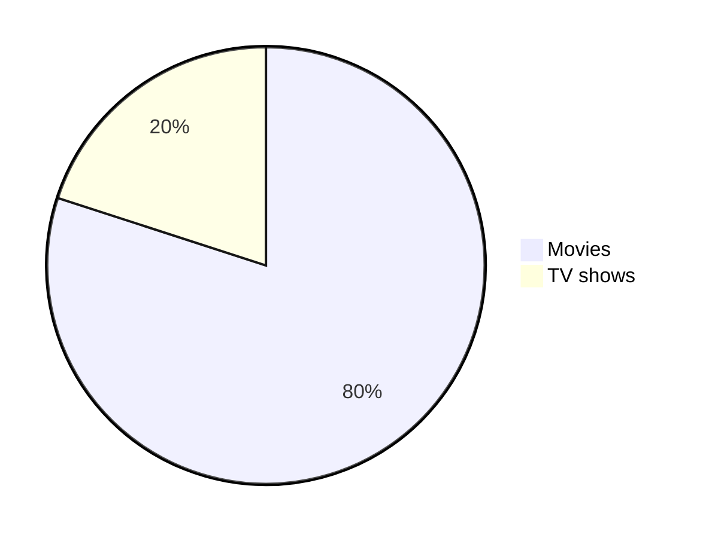

[The Ultimate Markdown Cheat Sheet](https://towardsdatascience.com/the-ultimate-markdown-cheat-sheet-3d3976b31a0)

- [Headings](#headings)
- [Heading 1](#heading-1)
	* [Heading 2](#heading-2)
		+ [Heading 3](#heading-3)
			- [Heading 4](#heading-4)
				* [Heading 5](#heading-5)
- [Heading 1](#heading-1)
	* [Heading 2](#heading-2)
		+ [Heading 3](#heading-3)
			- [Heading 4](#heading-4)
				* [Heading 5](#heading-5)
- [Heading 1](#heading-1)
	* [Heading 2](#heading-2)
- [Text styles](#text-styles)
- [Syntax Highlighting](#syntax-highlighting)
- [Alignments](#alignments)
		+ [My latest Medium posts](#my-latest-medium-posts)
- [Tables](#tables)
- [Links](#links)
- [Images](#images)
- [Lists](#lists)
- [Buttons](#buttons)
- [Horizontal Rule](#horizontal-rule)
- [Diagrams (19 July 2022)](#diagrams-19-july-2022)
- [Mathematical expressions (19 July 2022)](#mathematical-expressions-19-july-2022)
- [Miscellaneous](#miscellaneous)
- [Hash symbol](#hash-symbol)


# Headings

```
# Heading 1
## Heading 2
### Heading 3
#### Heading 4
##### Heading 5
```

# Heading 1
## Heading 2
### Heading 3
#### Heading 4
##### Heading 5

```
<h1>Heading 1</h1>
<h2>Heading 2</h2>
<h3>Heading 3</h3>
<h4>Heading 4</h4>
<h5>Heading 5</h5>
```

<h1>Heading 1</h1>
<h2>Heading 2</h2>
<h3>Heading 3</h3>
<h4>Heading 4</h4>
<h5>Heading 5</h5>

Heading 1
=
Heading 2
-

# Text styles

```
Bold
**The quick brown fox jumps over the lazy dog.**
__The quick brown fox jumps over the lazy dog.__
<strong>The quick brown fox jumps over the lazy dog.</strong>
Italic
*The quick brown fox jumps over the lazy dog.*
_The quick brown fox jumps over the lazy dog._
<em>The quick brown fox jumps over the lazy dog.</em>
Bold and Italic
**_The quick brown fox jumps over the lazy dog._**
<strong><em>The quick brown fox jumps over the lazy dog.</em></strong>
```

The quick brown fox jumps over the lazy dog.

Bold

**The quick brown fox jumps over the lazy dog.**

__The quick brown fox jumps over the lazy dog.__

<strong>The quick brown fox jumps over the lazy dog.</strong>


Italic

*The quick brown fox jumps over the lazy dog.*

_The quick brown fox jumps over the lazy dog._

<em>The quick brown fox jumps over the lazy dog.</em>

Bold and Italic

**_The quick brown fox jumps over the lazy dog._**

<strong><em>The quick brown fox jumps over the lazy dog.</em></strong>

Blockquotes

```
> The quick brown fox jumps over the lazy dog.
> The quick brown fox jumps over the lazy dog.
> 
> The quick brown fox jumps over the lazy dog.
> 
> The quick brown fox jumps over the lazy dog.
> The quick brown fox jumps over the lazy dog.
>> The quick brown fox jumps over the lazy dog.
>>> The quick brown fox jumps over the lazy dog.
> **The quick brown fox** *jumps over the lazy dog.*
```

> The quick brown fox jumps over the lazy dog.

> The quick brown fox jumps over the lazy dog.
> 
> The quick brown fox jumps over the lazy dog.
> 
> The quick brown fox jumps over the lazy dog.

> The quick brown fox jumps over the lazy dog.
>> The quick brown fox jumps over the lazy dog.
>>> The quick brown fox jumps over the lazy dog.

> **The quick brown fox** *jumps over the lazy dog.*

```
Monospaced
<samp>The quick brown fox jumps over the lazy dog.</samp>

Underlined
<ins>The quick brown fox jumps over the lazy dog.</ins>

Strike-through
~~The quick brown fox jumps over the lazy dog.~~
```

Monospaced

<samp>The quick brown fox jumps over the lazy dog.</samp>

Underlined

<ins>The quick brown fox jumps over the lazy dog.</ins>

Strike-through

~~The quick brown fox jumps over the lazy dog.~~

```
Boxed
<table><tr><td>The quick brown fox jumps over the lazy dog.</td></tr></table>
```

Boxed

<table><tr><td>The quick brown fox jumps over the lazy dog.</td></tr></table>


```
2 <sup>53-1</sup> and -2 <sup>53-1</sup> 
```

2 <sup>53-1</sup> and -2 <sup>53-1</sup> 

```
Subscript <sub>The quick brown fox jumps over the lazy dog.</sub>
Superscript <sup>The quick brown fox jumps over the lazy dog.</sup>
```

Subscript <sub>The quick brown fox jumps over the lazy dog.</sub>

Superscript <sup>The quick brown fox jumps over the lazy dog.</sup>


# Syntax Highlighting

A class method is an instance method of the class object. When a new class is created, an object of type `Class` is initialized and assigned to a global constant (Mobile in this case).


```
public static String monthNames[] = {"January", "February", "March", "April", "May", "June", "July", "August", "September", "October", "November", "December"};
```


```java
public static String monthNames[] = {"January", "February", "March", "April", "May", "June", "July", "August", "September", "October", "November", "December"};
```

# Alignments
```
<p align="left">

</p>
```

<p align="left">

</p>

```
<p align="center">

</p>
```

<p align="center">

</p>

```
<p align="right">

</p>
```

<p align="right">

</p>

```
<h3 align="center"> My latest Medium posts </h3>
```

<h3 align="center"> My latest Medium posts </h3>


# Tables

```
<table>
<tr>
<td width="33%"">
The quick brown fox jumps over the lazy dog.
</td>
<td width="33%">
The quick brown fox jumps over the lazy dog.
</td>
<td width="33%">
The quick brown fox jumps over the lazy dog.
</td>
</tr>
</table>
```

<table>
<tr>
<td width="33%"">
The quick brown fox jumps over the lazy dog.
</td>
<td width="33%">
The quick brown fox jumps over the lazy dog.
</td>
<td width="33%">
The quick brown fox jumps over the lazy dog.
</td>
</tr>
</table>


```
| Default | Left align | Center align | Right align |
| - | :- | :-: | -: |
| 9999999999 | 9999999999 | 9999999999 | 9999999999 |
| 999999999 | 999999999 | 999999999 | 999999999 |
| 99999999 | 99999999 | 99999999 | 99999999 |
| 9999999 | 9999999 | 9999999 | 9999999 |


| Default    | Left align | Center align | Right align |
| ---------- | :--------- | :----------: | ----------: |
| 9999999999 | 9999999999 | 9999999999   | 9999999999  |
| 999999999  | 999999999  | 999999999    | 999999999   |
| 99999999   | 99999999   | 99999999     | 99999999    |
| 9999999    | 9999999    | 9999999      | 9999999     |


Default    | Left align | Center align | Right align
---------- | :--------- | :----------: | ----------:
9999999999 | 9999999999 | 9999999999   | 9999999999 
999999999  | 999999999  | 999999999    | 999999999  
99999999   | 99999999   | 99999999     | 99999999   
9999999    | 9999999    | 9999999      | 9999999 
```

| Default | Left align | Center align | Right align |
| - | :- | :-: | -: |
| 9999999999 | 9999999999 | 9999999999 | 9999999999 |
| 999999999 | 999999999 | 999999999 | 999999999 |
| 99999999 | 99999999 | 99999999 | 99999999 |
| 9999999 | 9999999 | 9999999 | 9999999 |


| Default    | Left align | Center align | Right align |
| ---------- | :--------- | :----------: | ----------: |
| 9999999999 | 9999999999 | 9999999999   | 9999999999  |
| 999999999  | 999999999  | 999999999    | 999999999   |
| 99999999   | 99999999   | 99999999     | 99999999    |
| 9999999    | 9999999    | 9999999      | 9999999     |


Default    | Left align | Center align | Right align
---------- | :--------- | :----------: | ----------:
9999999999 | 9999999999 | 9999999999   | 9999999999 
999999999  | 999999999  | 999999999    | 999999999  
99999999   | 99999999   | 99999999     | 99999999   
9999999    | 9999999    | 9999999      | 9999999 


```
<table>
<tr>
<th>Heading 1</th>
<th>Heading 2</th>
</tr>
<tr>

<td>

| A | B | C |
|--|--|--|
| 1 | 2 | 3 |

</td><td>

| A | B | C |
|--|--|--|
| 1 | 2 | 3 |

</td></tr> </table>
```

<table>
<tr>
<th>Heading 1</th>
<th>Heading 2</th>
</tr>
<tr>

<td>

| A | B | C |
|--|--|--|
| 1 | 2 | 3 |

</td><td>

| A | B | C |
|--|--|--|
| 1 | 2 | 3 |

</td></tr> </table>

```
| A | B | C |
|---|---|---|
| 1 | 2 | 3 <br/> 4 <br/> 5 |
```

| A | B | C |
|---|---|---|
| 1 | 2 | 3 <br/> 4 <br/> 5 |


```
<table>
<tr>
<th>Before Hoisting</th>
<th>After Hoisting</th>
</tr>
<tr>
<td>
<pre lang="js">
console.log(fullName); // undefined
fullName = "Dariana Trahan";
console.log(fullName); // Dariana Trahan
var fullName;
</pre>
</td>
<td>
<pre lang="js">
var fullName;
console.log(fullName); // undefined
fullName = "Dariana Trahan";
console.log(fullName); // Dariana Trahan
</pre>
</td>
</tr>
</table>
```

<table>
<tr>
<th>Before Hoisting</th>
<th>After Hoisting</th>
</tr>
<tr>
<td>
<pre lang="js">
console.log(fullName); // undefined
fullName = "Dariana Trahan";
console.log(fullName); // Dariana Trahan
var fullName;
</pre>
</td>
<td>
<pre lang="js">
var fullName;
console.log(fullName); // undefined
fullName = "Dariana Trahan";
console.log(fullName); // Dariana Trahan
</pre>
</td>
</tr>
</table>

# Links

```
[The-Ultimate-Markdown-Cheat-Sheet](https://github.com/lifeparticle/Markdown-Cheatsheet)
```

[The-Ultimate-Markdown-Cheat-Sheet](https://github.com/lifeparticle/The-Ultimate-Markdown-Cheat-Sheet)

```
[The-Ultimate-Markdown-Cheat-Sheet][reference text]

[The-Ultimate-Markdown-Cheat-Sheet][1]

[Markdown-Cheat-Sheet]

[reference text]: https://github.com/lifeparticle/Markdown-Cheatsheet
[1]: https://github.com/lifeparticle/Markdown-Cheatsheet
[Markdown-Cheat-Sheet]: https://github.com/lifeparticle/Markdown-Cheatsheet
```

[The-Ultimate-Markdown-Cheat-Sheet][reference text]

[The-Ultimate-Markdown-Cheat-Sheet][1]

[Markdown-Cheat-Sheet]

[reference text]: https://github.com/lifeparticle/The-Ultimate-Markdown-Cheat-Sheet
[1]: https://github.com/lifeparticle/The-Ultimate-Markdown-Cheat-Sheet
[Markdown-Cheat-Sheet]: https://github.com/lifeparticle/The-Ultimate-Markdown-Cheat-Sheet


```
[Example of a relative link](rl.md)
```

[Example of a relative link](rl.md)


Visit https://github.com/

# Images

```

```


```
![alt text][image]

[image]: https://images.unsplash.com/photo-1415604934674-561df9abf539?ixlib=rb-1.2.1&ixid=eyJhcHBfaWQiOjEyMDd9&auto=format&fit=crop&w=100&q=80
```
![alt text][image]

[image]: https://images.unsplash.com/photo-1415604934674-561df9abf539?ixlib=rb-1.2.1&ixid=eyJhcHBfaWQiOjEyMDd9&auto=format&fit=crop&w=100&q=80

```

```


# Lists

```
1. One
2. Two
3. Three
```

1. One
2. Two
3. Three

```
1. First level
    1. Second level
        - Third level
            - Fourth level
2. First level
    1. Second level
3. First level
    1. Second level
```


1. First level
    1. Second level
        - Third level
            - Fourth level
2. First level
    1. Second level
3. First level
    1. Second level
    


```
* 1
* 2
* 3

+ 1
+ 2
+ 3


- 1
- 2
- 3
```

* 1
* 2
* 3

+ 1
+ 2
+ 3


- 1
- 2
- 3


```
- First level
    - Second level
        - Third level
            - Fourth level
- First level
    - Second level
- First level
    - Second level
```

- First level
    - Second level
        - Third level
            - Fourth level
- First level
    - Second level
- First level
    - Second level

```
<ul>
<li>First item</li>
<li>Second item</li>
<li>Third item</li>
<li>Fourth item</li>
</ul>
```

<ul>
<li>First item</li>
<li>Second item</li>
<li>Third item</li>
<li>Fourth item</li>
</ul>

```
- [x] Fix Bug 223
- [ ] Add Feature 33
- [ ] Add unit tests
```

- [x] Fix Bug 223
- [ ] Add Feature 33
- [ ] Add unit tests

# Buttons

```
<kbd>cmd + shift + p</kbd>
```

<kbd>cmd + shift + p</kbd>

```
<kbd> <br> cmd + shift + p <br> </kbd>
```

<kbd> <br> cmd + shift + p <br> </kbd>

```
<kbd>[Markdown-Cheatsheet](https://github.com/lifeparticle/Markdown-Cheatsheet)</kbd>
```

<kbd>[Markdown-Cheatsheet](https://github.com/lifeparticle/Markdown-Cheatsheet)</kbd>

```
[<kbd>Markdown-Cheatsheet</kbd>](https://github.com/lifeparticle/Markdown-Cheatsheet)
```

[<kbd>Markdown-Cheatsheet</kbd>](https://github.com/lifeparticle/Markdown-Cheatsheet)

# Collapsible items (28 July 2023)


```
<details>
  <summary>Markdown</summary>

-  <kbd>[Markdown Editor](https://binarytree.dev/me)</kbd>
-  <kbd>[Table Of Content](https://binarytree.dev/toc)</kbd>
-  <kbd>[Markdown Table Generator](https://binarytree.dev/md_table_generator)</kbd>

</details>
```

<details>
  <summary>Markdown</summary>

-  <kbd>[Markdown Editor](https://binarytree.dev/me)</kbd>
-  <kbd>[Table Of Content](https://binarytree.dev/toc)</kbd>
-  <kbd>[Markdown Table Generator](https://binarytree.dev/md_table_generator)</kbd>

</details>


# Horizontal Rule

```
---
***
___
```

---

***

___

# Diagrams (19 July 2022)


```
pie
"Movies" : 80
"TV shows" : 20
```

          


# Mathematical expressions (19 July 2022)

```
This is an inline math expression $x = {-b \pm \sqrt{b^2-4ac} \over 2a}$
```
          
This is an inline math expression $x = {-b \pm \sqrt{b^2-4ac} \over 2a}$
          
```
x = {-b \pm \sqrt{b^2-4ac} \over 2a}
```

$$
x = {-b \pm \sqrt{b^2-4ac} \over 2a}
$$

# Alerts (8 January 2024)


```
> [!NOTE]  
> Essential details that users should not overlook, even when browsing quickly.

> [!TIP]
> Additional advice to aid users in achieving better outcomes.

> [!IMPORTANT]  
> Vital information required for users to attain success.

> [!WARNING]  
> Urgent content that requires immediate user focus due to possible risks.

> [!CAUTION]
> Possible negative outcomes resulting from an action.
```


> [!NOTE]  
> Essential details that users should not overlook, even when browsing quickly.

> [!TIP]
> Additional advice to aid users in achieving better outcomes.

> [!IMPORTANT]  
> Vital information required for users to attain success.

> [!WARNING]  
> Urgent content that requires immediate user focus due to possible risks.

> [!CAUTION]
> Possible negative outcomes resulting from an action.

          
# Miscellaneous

<!--
Lorem ipsum dolor sit amet
-->

```
*   Asterisk
\   Backslash
`   Backtick
{}  Curly braces
.   Dot
!   Exclamation mark
#   Hash symbol
-   Hyphen symbol
()  Parentheses
+   Plus symbol
[]  Square brackets
_   Underscore`
```

*   Asterisk
\   Backslash
`   Backtick
{}  Curly braces
.   Dot
!   Exclamation mark
#   Hash symbol
-   Hyphen symbol
()  Parentheses
+   Plus symbol
[]  Square brackets
_   Underscore


```
\*   Asterisk
\\   Backslash
\`   Backtick
\{}  Curly braces
\.   Dot
\!   Exclamation mark
\#   Hash symbol
\-   Hyphen symbol
\()  Parentheses
\+   Plus symbol
\[]  Square brackets
\_   Underscore
```

\*   Asterisk
\\   Backslash
\`   Backtick
\{}  Curly braces
\.   Dot
\!   Exclamation mark
\#   Hash symbol
\-   Hyphen symbol
\()  Parentheses
\+   Plus symbol
\[]  Square brackets
\_   Underscore

```
:octocat:
```

:octocat:


```
@lifeparticle
```

@lifeparticle

```
#
```

\#


[Back to top](#)
