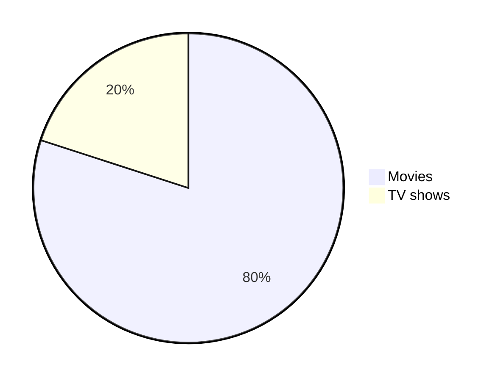
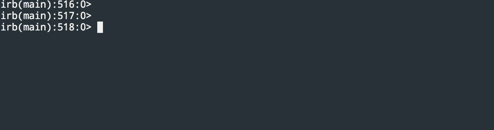

# Supported file extensions

| Content Type | Supported Extensions                                                       | Description                               |
|--------------|----------------------------------------------------------------------------|-------------------------------------------|
| mermaid      | [.mermaid](./pie_chart.mermaid), [.mmd](./pie_chart.mmd)                   | Diagramming and charting tool             |
| geoJSON      | [.geojson](./fictional_park.geojson), [.json](./fictional_park.json)       | Format for encoding geographic data       |
| topoJSON     | [.topojson](./fictional_park.topojson), .json                              | Extension of GeoJSON for topology data    |
| STL          | [.stl](./solid_cube.stl)                                                   | File format for 3D models                 |
| Markdown     | [.markdown](./documentation.markdown), [.md](./documentation.md)           | Markup language for formatting text       |
| SVG          | [.svg](./theultimatemarkdowncheatsheet-brightgreen.svg), [.svg](./md.svg)  | Scalable Vector Graphics file format      |
| PNG          | [.png](./BinaryTree.png)                                                   | Portable Network Graphics file format     |
| GIF          | [.gif](./ruby.gif)                                                         | Graphics Interchange Format file          |
| JPEG         | [.jpg](./BinaryTree.jpg), .jpeg                                            | JPEG image file format                    |
| Text         | [.txt](./todo.txt)                                                         | Plain text file                           |

## mermaid



````md

````

## geoJSON

```geojson
{
    "type": "FeatureCollection",
    "features": [
      {
        "type": "Feature",
        "geometry": {
          "type": "Polygon",
          "coordinates": [
            [
              [-100.0, 40.0],
              [-99.0, 40.0],
              [-99.0, 41.0],
              [-100.0, 41.0],
              [-100.0, 40.0]
            ]
          ]
        },
        "properties": {
          "name": "Fictional Park",
          "description": "A large, fictional park for demonstration purposes."
        }
      }
    ]
  }
```

````md
```geojson
{
    "type": "FeatureCollection",
    "features": [
      {
        "type": "Feature",
        "geometry": {
          "type": "Polygon",
          "coordinates": [
            [
              [-100.0, 40.0],
              [-99.0, 40.0],
              [-99.0, 41.0],
              [-100.0, 41.0],
              [-100.0, 40.0]
            ]
          ]
        },
        "properties": {
          "name": "Fictional Park",
          "description": "A large, fictional park for demonstration purposes."
        }
      }
    ]
  }
```
````

## topoJSON

```topojson
{
  "type": "Topology",
  "objects": {
    "fictional_park": {
      "type": "GeometryCollection",
      "geometries": [
        {
          "type": "Polygon",
          "arcs": [[0]],
          "properties": {
            "name": "Fictional Park",
            "description": "A large, fictional park for demonstration purposes."
          }
        }
      ]
    }
  },
  "arcs": [
    [[-100, 40], [-99, 40], [-99, 41], [-100, 41], [-100, 40]]
  ],
  "transform": {
    "scale": [0.0001, 0.0001],
    "translate": [-100, 40]
  }
}
```

````md
```topojson
{
  "type": "Topology",
  "objects": {
    "fictional_park": {
      "type": "GeometryCollection",
      "geometries": [
        {
          "type": "Polygon",
          "arcs": [[0]],
          "properties": {
            "name": "Fictional Park",
            "description": "A large, fictional park for demonstration purposes."
          }
        }
      ]
    }
  },
  "arcs": [
    [[-100, 40], [-99, 40], [-99, 41], [-100, 41], [-100, 40]]
  ],
  "transform": {
    "scale": [0.0001, 0.0001],
    "translate": [-100, 40]
  }
}
```
````

## STL

```stl
solid cube
  facet normal 0 0 0
    outer loop
      vertex 0 0 0
      vertex 1 0 0
      vertex 1 1 0
    endloop
  endfacet
  facet normal 0 0 0
    outer loop
      vertex 0 0 0
      vertex 1 1 0
      vertex 0 1 0
    endloop
  endfacet
  facet normal 0 0 0
    outer loop
      vertex 0 0 1
      vertex 1 0 1
      vertex 1 1 1
    endloop
  endfacet
  facet normal 0 0 0
    outer loop
      vertex 0 0 1
      vertex 1 1 1
      vertex 0 1 1
    endloop
  endfacet
  facet normal 0 0 0
    outer loop
      vertex 0 0 0
      vertex 0 1 0
      vertex 0 1 1
    endloop
  endfacet
  facet normal 0 0 0
    outer loop
      vertex 0 0 0
      vertex 0 1 1
      vertex 0 0 1
    endloop
  endfacet
  facet normal 0 0 0
    outer loop
      vertex 1 0 0
      vertex 1 1 0
      vertex 1 1 1
    endloop
  endfacet
  facet normal 0 0 0
    outer loop
      vertex 1 0 0
      vertex 1 1 1
      vertex 1 0 1
    endloop
  endfacet
  facet normal 0 0 0
    outer loop
      vertex 0 0 0
      vertex 0 0 1
      vertex 1 0 1
    endloop
  endfacet
  facet normal 0 0 0
    outer loop
      vertex 0 0 0
      vertex 1 0 1
      vertex 1 0 0
    endloop
  endfacet
  facet normal 0 0 0
    outer loop
      vertex 0 1 0
      vertex 0 1 1
      vertex 1 1 1
    endloop
  endfacet
  facet normal 0 0 0
    outer loop
      vertex 0 1 0
      vertex 1 1 1
      vertex 1 1 0
    endloop
  endfacet
endsolid cube
```

````md
```stl
solid cube
  facet normal 0 0 0
    outer loop
      vertex 0 0 0
      vertex 1 0 0
      vertex 1 1 0
    endloop
  endfacet
  facet normal 0 0 0
    outer loop
      vertex 0 0 0
      vertex 1 1 0
      vertex 0 1 0
    endloop
  endfacet
  facet normal 0 0 0
    outer loop
      vertex 0 0 1
      vertex 1 0 1
      vertex 1 1 1
    endloop
  endfacet
  facet normal 0 0 0
    outer loop
      vertex 0 0 1
      vertex 1 1 1
      vertex 0 1 1
    endloop
  endfacet
  facet normal 0 0 0
    outer loop
      vertex 0 0 0
      vertex 0 1 0
      vertex 0 1 1
    endloop
  endfacet
  facet normal 0 0 0
    outer loop
      vertex 0 0 0
      vertex 0 1 1
      vertex 0 0 1
    endloop
  endfacet
  facet normal 0 0 0
    outer loop
      vertex 1 0 0
      vertex 1 1 0
      vertex 1 1 1
    endloop
  endfacet
  facet normal 0 0 0
    outer loop
      vertex 1 0 0
      vertex 1 1 1
      vertex 1 0 1
    endloop
  endfacet
  facet normal 0 0 0
    outer loop
      vertex 0 0 0
      vertex 0 0 1
      vertex 1 0 1
    endloop
  endfacet
  facet normal 0 0 0
    outer loop
      vertex 0 0 0
      vertex 1 0 1
      vertex 1 0 0
    endloop
  endfacet
  facet normal 0 0 0
    outer loop
      vertex 0 1 0
      vertex 0 1 1
      vertex 1 1 1
    endloop
  endfacet
  facet normal 0 0 0
    outer loop
      vertex 0 1 0
      vertex 1 1 1
      vertex 1 1 0
    endloop
  endfacet
endsolid cube
```
````

## Markdown

**It works.**

```md
**It works.**
```

## SVG


```md

```

SVG Animation


```md

```

## PNG


```md

```

## GIF



```md

```

## JPEG


```md

```

## Text

```txt
[x] Task 1
[] Task 2
```

````md
```txt
[x] Task 1
[] Task 2
```
````
